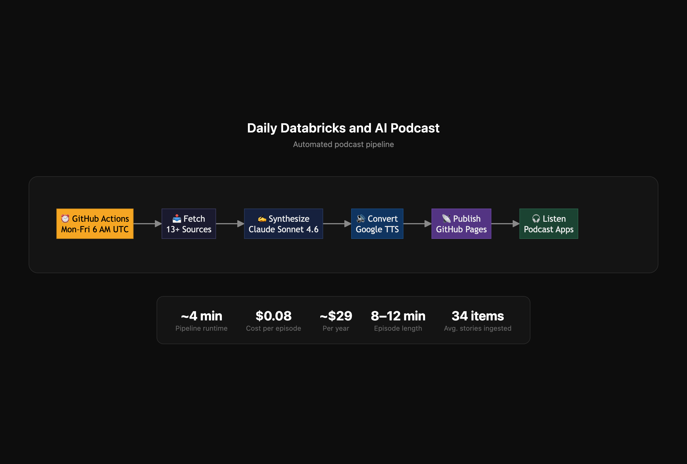

# The Data & AI Daily — Personal Podcast Automation

Automated daily two-host audio briefing covering Databricks releases and top AI/ML news, synthesized with Claude Sonnet 4.6 and delivered as a podcast RSS feed via GitHub Pages.

Wake up to a personalized 8-12 minute episode in your podcast app every weekday morning.



## 🎯 Features

- **Automated Daily Pipeline**: Runs Monday-Friday at 11:30 AM UTC (5:30 AM Central) via GitHub Actions
- **13+ Content Sources**: Databricks (blog, newsroom, release notes), AI labs (OpenAI, Anthropic, DeepMind, Meta), tech media (The Verge, TechCrunch, VentureBeat), Hacker News, arXiv
- **Two-Host AI Script**: Claude Sonnet 4.6 generates a two-host conversational script (HOST + COHOST) with Austin weather integration, plus a Haiku-generated episode summary
- **High-Quality Audio**: Google Cloud Text-to-Speech with Studio-O (HOST) and Studio-Q (COHOST) voices, with automatic per-speaker chunking for long scripts
- **Podcast RSS Feed**: Published to GitHub Pages with iTunes tags, artwork, and owner email for Spotify submission
- **Zero Infrastructure**: Completely free hosting via GitHub Pages + Actions

## 📋 Prerequisites

1. **Anthropic API Key** - Get from https://console.anthropic.com (requires $10 minimum credit purchase)
2. **Google Cloud Project** with:
   - Text-to-Speech API enabled
   - Service Account with JSON key
3. **GitHub Personal Access Token** (for local testing) - Create with `repo` scope
4. **Twitter API Bearer Token** (optional) - Free Basic tier from developer.twitter.com

## 🚀 Quick Start

### 1. Clone and Install

```bash
git clone https://github.com/tylernwatson/daily-podcast.git
cd daily-podcast
npm install
```

### 2. Configure Environment

Create `.env` file:

```bash
ANTHROPIC_API_KEY=sk-ant-your-key-here
GOOGLE_APPLICATION_CREDENTIALS=./service-account.json
TWITTER_BEARER_TOKEN=your-twitter-token  # Optional
GITHUB_TOKEN=ghp_your-personal-token-here  # For local testing
GITHUB_REPOSITORY=yourusername/yourrepo
PAGES_BASE_URL=https://yourusername.github.io/yourrepo
PODCAST_TITLE="Your Podcast Title"
PODCAST_AUTHOR=YourName
```

### 3. Set Up Google Cloud

1. Go to [Google Cloud Console](https://console.cloud.google.com/)
2. Create a new project
3. Enable **Cloud Text-to-Speech API**
4. Create Service Account:
   - IAM & Admin → Service Accounts → Create
   - Grant roles: "Service Account User"
   - Create JSON key → Save as `service-account.json`

### 4. Set Up GitHub Pages

```bash
# Create and push an empty gh-pages branch
git checkout --orphan gh-pages
git rm -rf .
mkdir episodes
echo "<h1>The Data & AI Daily</h1>" > index.html
git add .
git commit -m "Initialize gh-pages"
git push origin gh-pages
git checkout main
```

Then in GitHub: **Settings → Pages → Source → Deploy from branch → gh-pages → / (root)**

### 5. Add Podcast Artwork

`artwork.jpg` is hosted on the `gh-pages` branch (1400x1400 to 3000x3000 pixels, under 500KB). To update it, commit a new version to `gh-pages`.

### 6. Test Locally

```bash
node src/index.js
```

This will:
- Fetch content from all sources
- Generate a script with Claude
- Convert to MP3 with chunking
- Commit to your `gh-pages` branch

Check your GitHub Pages URL to verify: `https://yourusername.github.io/yourrepo/feed.xml`

## 🤖 GitHub Actions Setup

### Add Secrets

Go to: Settings → Secrets and variables → Actions → New repository secret

Add these secrets:

1. `ANTHROPIC_API_KEY` - Your Anthropic API key
2. `GCP_SERVICE_ACCOUNT_JSON` - Paste entire contents of `service-account.json`
3. `TWITTER_BEARER_TOKEN` - Twitter/X API Bearer Token (optional)
4. `PODCAST_AUTHOR` - Your name

### Add Variables

Go to: Settings → Secrets and variables → Actions → Variables tab

1. `PAGES_BASE_URL` - `https://yourusername.github.io/yourrepo`
2. `PODCAST_TITLE` - Your podcast title

### Schedule

The workflow runs automatically:
- **Time**: 11:30 AM UTC (5:30 AM CST / 6:30 AM CDT)
- **Days**: Monday - Friday
- **Manual**: Can also trigger via "Actions" tab → "Run workflow"

## 📱 Subscribe in Your Podcast App

Add your RSS feed URL to any podcast app:

```
https://yourusername.github.io/yourrepo/feed.xml
```

**Tested apps:**
- Pocket Casts: + → Add via URL
- Overcast: Add Podcast → paste URL
- Apple Podcasts: Library → … → Follow a Show → paste URL
- Castro: Subscriptions → + → paste URL

Enable **auto-download** in app settings so episodes are ready when you wake up.

**Note:** Spotify requires manual submission at [podcasters.spotify.com](https://podcasters.spotify.com) (RSS feed includes required iTunes tags and owner email).

## 📁 Project Structure

```
daily-podcast/
├── .github/workflows/
│   └── daily-briefing.yml    # GitHub Actions workflow
├── src/
│   ├── index.js               # Main orchestrator with retry logic
│   ├── fetcher.js             # 13+ content sources with web scraping
│   ├── synthesizer.js         # Claude API two-host script generation + weather
│   ├── tts.js                 # Google TTS with two-voice per-speaker chunking
│   ├── publisher.js           # RSS 2.0 + iTunes feed builder
│   ├── githubCommitter.js     # GitHub API commits to gh-pages
│   ├── costTracker.js         # Per-run cost tracking (Claude, TTS, Twitter)
│   ├── ttsUsageTracker.js     # Monthly TTS usage persistence to gh-pages
│   ├── weather.js             # Austin weather via wttr.in (standalone)
│   ├── uploader.js            # Google Drive upload (optional)
│   └── episodeMemory.js       # Episode deduplication memory
├── .env                       # Local config (gitignored)
├── service-account.json       # GCP credentials (gitignored)
├── package.json
└── README.md
```

## 🔧 How It Works

### Content Pipeline

1. **Fetch** (parallel):
   - Databricks: Release notes, blog (RSS), newsroom, exec tweets
   - AI Labs: OpenAI blog, Anthropic news, DeepMind blog, Meta AI
   - Tech Media: The Verge AI (RSS), TechCrunch AI (RSS), VentureBeat AI (RSS)
   - Community: Hacker News (filtered for AI/ML/Databricks), arXiv CS.AI (RSS)
   - Weather: Austin conditions from Open-Meteo API (free, no key)

2. **Synthesize**:
   - Send ~34 items + weather to Claude Sonnet 4.6
   - Claude writes a two-host (HOST + COHOST) 1,200-1,800 word script (8-12 minutes)
   - Personalized cold open with Austin weather
   - 3-6 themed segments with opinionated commentary and natural banter
   - Second Claude call (Haiku 4.5) generates a listener-facing episode summary

3. **Convert to Audio**:
   - Google Cloud TTS with two voices: Studio-O (HOST) and Studio-Q (COHOST)
   - Script parsed by `[HOST]`/`[COHOST]` tags, each segment synthesized with the correct voice
   - Automatic chunking for segments >4,500 bytes
   - Sentence-based splitting to preserve natural pauses
   - Binary MP3 concatenation

4. **Publish**:
   - Commit MP3 to `gh-pages/episodes/AI-Briefing-YYYY-MM-DD.mp3`
   - Update `gh-pages/feed.xml` with new episode at top
   - RSS includes iTunes tags, artwork, duration, file size

5. **Deliver**:
   - Podcast apps poll RSS feed every few hours
   - Auto-download new episodes
   - Wake up to fresh episode

## 💰 Cost Estimate

| Service | Usage | Cost/day |
|---------|-------|----------|
| Claude API (Sonnet 4.6 + Haiku 4.5) | ~8,000 input + 2,500 output tokens (script) + summary call | ~$0.05 |
| Google TTS (Studio-O + Studio-Q) | ~10,000 characters (8-12 min) | ~$0.04 |
| Open-Meteo Weather API | Daily forecast call | Free |
| Twitter API v2 | User timeline calls (if used) | Free |
| GitHub Actions | ~4 min runtime | Free |
| GitHub Pages | Static hosting | Free |
| **Total** | | **~$0.08/day (~$29/year)** |

## 🎨 Customization

### Change Voices

Edit `src/tts.js` — the `VOICE_CONFIGS` object controls which voice each host uses:

```javascript
const VOICE_CONFIGS = {
  HOST: { languageCode: 'en-US', name: 'en-US-Studio-O' },
  COHOST: { languageCode: 'en-US', name: 'en-US-Studio-Q' },
};
```

Other options: `en-US-Journey-D`, `en-US-Journey-F`, `en-US-Neural2-A`, etc.

### Change Location/Weather

Edit `src/synthesizer.js` to fetch weather for your city:

```javascript
async function fetchAustinWeather() {
  const url = 'https://api.open-meteo.com/v1/forecast'
    + '?latitude=YOUR_LAT&longitude=YOUR_LON'
    + '&current=temperature_2m,weathercode,windspeed_10m'
    + '&daily=temperature_2m_max,temperature_2m_min,precipitation_probability_max'
    + '&temperature_unit=fahrenheit&wind_speed_unit=mph&timezone=YOUR_TIMEZONE&forecast_days=1';
  // ...
}
```

### Adjust Schedule

Edit `.github/workflows/daily-briefing.yml`:

```yaml
schedule:
  - cron: '30 11 * * 1-5'  # 11:30 AM UTC = 5:30 AM CST / 6:30 AM CDT
```

### Modify Content Sources

Edit `src/fetcher.js`:
- Add new scrapers in the style of existing ones
- Remove sources you don't care about
- Adjust filtering logic for Hacker News

### Personalize the Prompt

Edit `src/synthesizer.js` — change the Claude prompt to:
- Use your name instead of "Tyler"
- Adjust tone/style preferences
- Modify segment structure
- Change target length

## 🐛 Troubleshooting

### "Your credit balance is too low"
- Anthropic API credits are separate from Claude Pro subscription
- Add credits at https://console.anthropic.com/settings/billing

### "Voice not found" error
- Studio voices require Google Cloud TTS API v1
- Verify `en-US-Studio-O` and `en-US-Studio-Q` are available in your GCP region
- Alternative: Use `en-US-Journey-D`/`en-US-Journey-F` or `en-US-Neural2-A` for standard quality

### "input.text is longer than the limit of 5000 bytes"
- The chunking system should handle this automatically
- If error persists, reduce `max_tokens` in `src/synthesizer.js` to generate shorter scripts

### Databricks/Anthropic newsroom returns 0 items
- Web page structure may have changed
- Check `src/fetcher.js` CSS selectors
- Use browser dev tools to inspect live HTML
- Update selectors to match current page structure

### Duration shows incorrectly in podcast apps
- Verify duration calculation in `src/index.js`:
  ```javascript
  const durationSeconds = Math.round((fileSizeBytes * 8) / (128 * 1000));
  ```
- This formula assumes MP3 at 128 kbps

### GitHub Actions fails with 401
- Verify `GITHUB_TOKEN` is automatically provided by Actions (no setup needed)
- For local testing, create Personal Access Token with `repo` scope

### Podcast artwork not showing
- Verify `artwork.jpg` exists on the `gh-pages` branch
- Check file size (must be under 500 KB)
- Dimensions must be square (1400x1400 to 3000x3000 px)
- Wait for podcast apps to refresh feed (or unsubscribe/resubscribe)

## 📝 Development

### Run Locally

```bash
node src/index.js
```

### Test Individual Components

```javascript
// Test fetcher
const { fetchDatabricksContent, fetchAINews } = require('./src/fetcher');
fetchDatabricksContent().then(console.log);

// Test synthesizer
const { synthesizeScript } = require('./src/synthesizer');
const contentBundle = { databricks: [], aiNews: [] };
synthesizeScript(contentBundle).then(console.log);

// Test TTS chunking
const { convertToAudio } = require('./src/tts');
const longScript = "..."; // 8000+ bytes
convertToAudio(longScript, '/tmp/test.mp3').then(() => console.log('Done'));
```

## 🚀 Future Enhancements

- [ ] Auto-prune episodes older than 90 days (stay under GitHub's 1 GB repo limit)
- [ ] Commit transcript `.txt` alongside each MP3
- [ ] Friday "week in review" mode (detect day and adjust prompt)
- [ ] Deduplication log (`seen-items.json` in gh-pages to avoid repeating news)
- [ ] Slack/email notification when episode publishes
- [x] ~~Multiple voices for two-host conversational format~~ (implemented: Studio-O + Studio-Q)
- [ ] Analytics (episode downloads, listener stats)

## 📖 Blog Post

For a detailed writeup on how this was built using "vibe coding" with Claude Code, see [`How I Built a Databricks & AI Industry Podcast with Claude Code in One Afternoon
](https://medium.com/@tyler.n.watson/how-i-built-a-personal-databricks-ai-industry-podcast-with-claude-code-in-one-afternoon-8e2035740c7d).

## 📄 License

MIT License - Feel free to use and modify for your own podcast automation!

## 👤 Author

Tyler
- Email: [howdy@tyler.rodeo](mailto:howdy@tyler.rodeo)
- Podcast: [The Data & AI Daily](https://tylernwatson.github.io/daily-podcast/feed.xml)

---

**Built with Claude Code in 3 hours. Total cost: ~$29/year. Value: 30 minutes saved every morning.**
